# A PoC for assembling Lexical using USX3.0 <-> USJ

```mermaid
---
title: ScriptureData—Editor flow
---
graph TB
  DB[(DB)] <-- USX --> C
  C[USX-USJ converter] -- USJ --> A
  A[USJ-Editor adapter] -- Editor State --> Editor
  A -. NYI* .-> C
  Editor -. NYI* .-> A

  click C "https://github.com/abelpz/bible-lexical-editor/tree/main/packages/shared/converters/usj"
  click A "https://github.com/abelpz/bible-lexical-editor/blob/main/packages/platform/src/editor/plugins/UpdateStatePlugin.tsx"

  Editor ~~~ Key[NYI* - Not Yet Implemented]
  style Key fill:#fff,stroke:#fff
```



## Develop in App

To develop an editor in a target application you can use [yalc](https://www.npmjs.com/package/yalc) to link the editor in without having to publish to NPM every time something changes.

1. Install `yalc` globally:
   ```bash
   npm i -g yalc
   ```
2. In this monorepo, publish the editor to `yalc`, e.g.:
   ```bash
   nx devpub platform
   ```
3. In the target application repo, link from `yalc`:
   ```bash
   yalc link platform
   ```
4. In this monorepo, make changes and re-publish the editor (see step 2).
5. In the target application repo, update from `yalc`:
   ```bash
   yalc update platform
   ```
6. When you have finished developing, unlink from `yalc`:
   ```bash
   yalc remove platform
   ```
